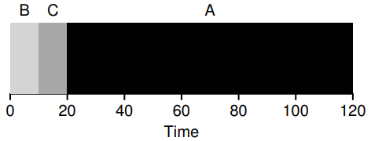

Cameron Wright\
Dr. Ribeiro\
CSE4001 Sect. 01\
11th of November 2020

<h2>

Implement Scheduler Assignment

</h2>

### Design:
To properly measure the effectiveness of my design against others, simple metrics need to be defined. The first of these metrics is turnaround time, which is a measure of performance and is the average time it takes each thread to complete. Thus, the longer threads have to wait in the queue, the worse the turnaround time will be. The second metric is response time, which measures reactivity and is the time before initial scheduling (executing) of each thread. Thus, the longer the time between thread scheduling, the worse the response time. Now that there are defined metrics, I can compare my design to others.

I decided to implement a FIFO (First In First Out) or FCFS (First Come First Serve) scheduler that works by running each process in the order they arrive.

FIFO is the simplest scheduler implementation, as it's just a simple queue. Thus it has sub-optimal turnaround times, in general, compared to others such as SJF (Shortest Job First) or STCF (Shortest Time to Completion First). Both of these scheduler implementations attempt to run the shortest of all the threads in the run queue first, resulting in equal or quicker turn around times than FIFO (see diagrams below).

\

While turnaround time is important in performance, reactivity is important; after all, you don't want to leave a user waiting.
Once again, my FIFO implementation is outdone by another scheduler implementation, RR (Round Robin) scheduling. This implementation focuses response time by rapidly switching between threads in the queue until each is complete.

Allowing for much quicker response times and even exponentially better turnaround times when working on a multi-core system, as threads can be spread between cores. However, in the OS161 implementation, there is only a single core, and thus the turn around time ends up being worse due to the cost of switching between threads. So much worse, FIFO ends up with better turnaround times, which is reflected in the benchmark results.

 

### Implementation:
I implemented my FIFO scheduler by modifying the existing RR implementation. The current implementation switches between the threads on the run queue in the order they arrive. It does this within the hardclock function.

This is the heart of the RR implementation; every time *thread_timeryield( )* is called, it calls *thread_switch( )* with parameters indicating both the new status of the current (running) thread and that it was called from a timer. *thread_switch( )* then sets its status and swaps the current thread with the next thread on the run queue. Thus, to implement a FIFO scheduler, this function needs to be removed. Then instead of swapping based on hardclocks, threads will just be run as they arrive and until they are complete.
However, there is more inside the hardclock function, and I want my FIFO implementation to be clean. Thus, in addition to removing *thread_timeryield( )*, the schedule function, which is empty, is also removed. Furthermore, the *thread_consider_migration( )* function checks if other CPUs are free and moves threads accordingly, spreading the load. The issue is, as mentioned before, OS161 is operating on only a single CPU; thus, there is no need, and this is removed as well.

This is the resulting implementation of my FIFO scheduling algorithm, and although there was no additional code added. The removal of the RR scheduling code left only the components of a FIFO scheduler remaining. A simple run queue data structure is used to store threads as they arrive, which runs each thread until completion once they reach the queue's head (front).

 

### Benchmark:

<h4>

Default Scheduler [Round Robin]

</h4>

\
\

 

<h4>

Implemented Scheduler [FIFO]:

</h4>

\
\

#### Sources:
*All scheduler diagrams are from [Operating Systems: Three Easy Pieces (Arpaci-Dusseau)](http://pages.cs.wisc.edu/~remzi/OSTEP/ "E-Book")*.
